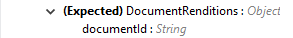
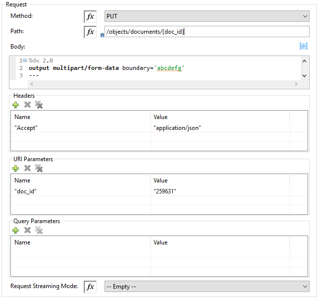

= VeevaVault Connector Additional Configuration Information - Mule 4
ifndef::env-site,env-github[]
include::_attributes.adoc[]
endif::[]
:imagesdir: ../../assets/images/

Veeva Vault Connector supports the following operations and configurations:

*Documents*

* link:#create-documents[*Create Documents*]
* link:#get-documents[*Get Documents*]
* link:#delete-documents[*Delete Documents*]
* link:#update-documents[*Update Documents*]
* link:#export-documents[*Export Documents*]

*Document Renditions*

* link:#create-document-renditions[*Create Document Renditions*]
* link:#get-document-renditions-types[*Get Document Renditions Types*]
* link:#delete-document-renditions[*Delete Document Renditions*]

*Vault Objects*

* link:#create-object-records[*Create Object Records*]
* link:#get-object-records[*Get Object Records*]
* link:#delete-object-records[*Delete Object Records*]
* link:#update-object-records[*Update Object Records*]

*VQL Query*

* link:#query[*Query*]

*Picklists*

* link:#get-picklists[*Get Picklists*]

*Audit*

* link:#get-audit-details[*Get Audit Details*]

*Spark Messaging*

* link:#spark-validator[*Spark Validator*]

*Invoke Rest API*

* link:#invoke-rest-api[*Invoke Rest API*]

=== Connector Configuration

image:../../assets/images/veevavault/veevavault-connector-basic-configuration.png[image,width=601,height=54]

*Follow the instructions in link:veevavault-connector-reference.adoc#veevavault-connector-connection-config[Connector Configuration]*

=== Create Documents

The Create Documents operation enables you to create single or multiple document(s) with provided document metadata in CSV or JSON format. Make sure you have uploaded document files on Vault FTP server location for document content to attach with created documents.

==== Create Documents Configuration

image:../../assets/images/veevavault/veevavault-connector-create-documents.png[image,width=601,height=90]

[cols=",",options="header",]
|===
|Field |Description
|Metadata Format |Select CSV or JSON option to accept document metadata in specified format.
|Document Metadata |Document Metadata payload with required metadata either in CSV or JSON format. Make sure payload would be in format as specified in Metadata format field.
|Input a|
The following shows the document metadata required to create documents on vault. Ensure payload has mandatory metadata for the vault.

|Output a|
The Create Documents operation output status or response from the vault.

image:../../assets/images/veevavault/veevavault-connector-create-documents-output.png[image,width=297,height=213]

Note : Check the Success and Failure response status of operations link:#connector-operations-success-and-failure-response[*Connector Operations SUCCESS and FAILURE Response*].

|===

=== Get Documents

The Get Documents operation enables you to retrieve document details based on document type, subtype and classification selected. Using selected type, subtype and classification it fetches document properties metadata and builds VQL queries dynamically. The VQL query is then executed on Vault to retrieve document details. Place For-Each/Splitter element after this Operation to fetch each document data (page) sequentially.

This operation provides a paging mechanism based on Mule standard pagination. See link:#streaming-and-pagination[*Streaming and Pagination*] for more details.

The document type, subtype and classification are optional, if none are selected then document properties metadata are fetched using API *(/api/\{version}/metadata/objects/documents/properties)* and VQL Query is built based on document metadata properties added or inserted in *Document Properties* list, if metadata properties are not provided then all queryable document properties is used in VQL and executed.

==== Get Documents Configurations

[cols=",",options="header",]
|===
|Fields |Description
|Type (Optional) |Click the refresh icon image:../../assets/images/veevavault/veevavault-connector-refresh-icon.png[image,width=22,height=22] to retrieve Document Types from the vault. Select a document type from the list to retrieve document properties.
|Subtype (Optional) |Click the refresh icon image:../../assets/images/veevavault/veevavault-connector-refresh-icon.png[image,width=22,height=22] to retrieve Document Subtypes from the vault. Select a document subtype from the list to retrieve document properties.
|Classification (Optional) |Click the refresh icon image:../../assets/images/veevavault/veevavault-connector-refresh-icon.png[image,width=22,height=22] to retrieve Document Classification from the vault. Select a document classification from the list to retrieve document properties.
|Document Properties (Optional) |Insert document properties as per business requirement and these properties will be used to build a VQL query to execute on vault.
|WHERE Clause |Insert a https://developer.veevavault.com/vql/#introduction-to-vault-queries[VQL] WHERE clause (without using keyword WHERE) conditions as per business requirement and it will be appended to dynamically to build VQL query to execute on vault. *E.g classification__v = ‘study_set_up_worksheet__c’*
|Fetch Size |Provide number of records per page. Default is 1000.
|Batch Size |Provide number of pages per batch. Default is 10.
|Input |N/A
|Output a|
You can find list of queryable document properties retrieved from the vault. If document properties list is provided, then specified properties detail is retrieve and result in operation output. Default is a list of all queryable properties.

|===

=== Delete Documents

The Delete Documents operation enables you to delete single or multiple documents using the bulk API with input metadata in CSV or JSON format.

==== Delete Documents Configuration

[cols=",",options="header",]
|===
|Field |Description
|Metadata Format |Select CSV or JSON option to accept document metadata in specified format.
|Document Metadata |Document Metadata payload with required metadata in CSV or JSON format (same as the specified value in *Metadata Format*).
|Input a|
The following shows the list of document metadata that’s required to delete documents on the vault.

image:../../assets/images/veevavault/veevavault-connector-delete-documents-input.png[image,width=301,height=55]

|Output a|
The delete documents operation output status or response from vault:

Note : Check the Success and Failure response status of operations in link:#connector-operations-success-and-failure-response[Connector Operations SUCCESS and FAILURE Response].*

|===

=== Update Documents

The Update Documents operation enables you to update bulk documents with the provided editable metadata in the payload in CSV or JSON format.

==== Update Documents Configuration

[cols=",",options="header",]
|===
|Field |Description
|Metadata Format |Select CSV or JSON option to accept document metadata in specified format.
|Document Metadata |Document metadata payload with the required editable metadata in CSV or JSON format. The payload should be in the format specified in the *Metadata Format* field.
|Input a|
The following is the list of editable document metadata to update documents on the vault. The payload should have only the editable metadata for that vault.

image:../../assets/images/veevavault/veevavault-connector-update-documents-input.png[image,width=286,height=343]

|Output a|
Update documents operation output status or response from the vault.

image:../../assets/images/veevavault/veevavault-connector-update-documents-output.png[image,width=303,height=148]

|===

=== Export Documents

An Export Documents operation enables you to query a set of documents for export to your vault’s FTP staging server. It is recommended to use Export Documents operation is separate asynchronous flow using Async Scope and passing payload with document ids. Using asynchronously the operation executes in separate flow thread, will wait for specified polling interval to poll the Job status until it gets successful while the main flow continues its process.

The exported documents are stored on FTP Staging area in folder, with the hierarchy structure: *\{root}/\{userId}/\{jobId}/\{documentIds}/\{versions}*. 

The following is an example of the Export Documents operation returning job results as response:
--------------------
[
  {
	"file": "/41601/249051/0_1/TestDocument.docx",
	"user_id__v": 1885110,
	"id": 249051,
	"responseStatus": "SUCCESS",
	"minor_version_number__v": 1,
	"major_version_number__v": 0
  },
  {
	"file": "/41601/249050/0_1/TestDocument.docx",
	"user_id__v": 1885110,
	"id": 249050,
	"responseStatus": "SUCCESS",
	"minor_version_number__v": 1,
	"major_version_number__v": 0
  },
  {
	"file": "/41601/249052/0_1/TestDocument.docx",
	"user_id__v": 1885110,
	"id": 249052,
	"responseStatus": "SUCCESS",
	"minor_version_number__v": 1,
	"major_version_number__v": 0
  }
]
--------------------

.The previous example shows the following attributes:
 
- +file+

	Has the format: +"/{jobId}/{documentId}/{major-minor-version}/{filename}"+, which is the absolute file path location on the Vault FTP server staging area.
 
- +user_id__v+

	Vault system user ID of a user whose credentials are configured in the connector. The folder is created on the Vault FTP server staging area root location under where the exported file is located. The folder is created with the name of the user ID prefixed with the letter +‘u’+; for example:

	+"/uXXXXXXX/{jobId}/{documentId}/{major-minor-version}/{filename}\)"+.

- +id+

	Document ID of the exported document file.

- +major_version_number__v+

	Major version number of the exported document file

- +minor_version_number__v+

	Minor version number of the exported document file

==== Export Documents Configuration

image:../../assets/images/veevavault/veevavault-connector-export-documents.png[image,width=601,height=221]

[cols=",",options="header",]
|===
|*Field* |*Description*
|*Metadata Format* |Select CSV or JSON option to accept metadata document Id in specified format.
|*Document Metadata* |Document Metadata payload contains document IDs in either CSV or JSON format. The payload should be in the format specified in the *Metadata Format* field.
|*Source* |(Optional) To exclude source files set to +false+. Default is +true+.
|*Renditions* |(Optional) To include renditions set to +true+. Default is +false+.
|*All Versions* |(Optional) To include all versions or latest version set to +true+. Default is +false+.
|*Polling Interval* |(Optional) Polls vault at specified interval (in seconds) until job is successful. Default is 30 seconds.
|*Input* a|
Input document metadata required to export documents from the vault to the FTP staging server. Make sure the payload has the mandatory metadata required for the vault.

image:../../assets/images/veevavault/veevavault-connector-export-documents-input.png[image,width=297,height=90]

|*Output* a|
The export documents job status response is under the Output tab:

image:../../assets/images/veevavault/veevavault-connector-export-documents-output.png[image,width=288,height=256]

Note : Check the Success and Failure response status of operations in link:#connector-operations-success-and-failure-response[Connector Operations SUCCESS and FAILURE Response].

|===

=== Create Document Renditions:

The Create Document Renditions operation enables you to add document renditions in bulk. Your vault must be in Migration Mode before using this operation. It takes CSV input data with a maximum size of 1 GB with a standard UTF-8-encoded value.

==== Create Document Renditions Configuration

[cols=",",options="header",]
|===
|*Field* |*Description*
|*Metadata Format* |Select CSV or JSON option to accept document metadata in specified format.
|*Document Metadata* |Document metadata payload with required metadata in CSV or JSON format. The payload must be in format specified in the *Metadata Format* field.
|*Input* a|
Document metadata required in payload under the Input tab:

image:../../assets/images/veevavault/veevavault-connector-create-document-renditions-input.png[image,width=280,height=188]

|*Output* a|
Operation output or response under the Output tab:

Note: Check the Success and Failure response status of operations  in  link:#connector-operations-success-and-failure-response[*Connector Operations SUCCESS and FAILURE Response*].

|===

=== Get Document Renditions Types

The Get Document Renditions Types operation enables you to retrieve document renditions types details.

==== Get Document Renditions Types Configuration

[cols=",",options="header",]
|===
|*Field* |*Description*
|*Document Metadata* |Document ID in the payload in either in CSV or JSON format.
|*Input* a|
Document ID required in the payload is under the Input tab of the retrieve document renditions details operation:

|*Output* a|
The following operation output or response is under the Output tab:

Note : Check the Success and Failure response status of operations in link:#connector-operations-success-and-failure-response[*Connector Operations SUCCESS and FAILURE Response*].

|===

=== Delete Document Renditions

The Delete Document Renditions operation enables you to delete document renditions in bulk using CSV or JSON format input metadata.

==== Delete Document Renditions Configuration

image:../../assets/images/veevavault/veevavault-connector-delete-document-renditions.png[image,width=601,height=90]

[cols=",",options="header",]
|===
|*Field* |*Description*
|*Metadata Format* |Select CSV or JSON option to accept document metadata in specified format.
|*Document Metadata* |Document Metadata payload with the required metadata in CSV or JSON format (specified in the *Metadata Format* field).
|*Input* a|
Document metadata required to create documents on the vault. Make sure the payload has the mandatory metadata required for the vault.

image:../../assets/images/veevavault/veevavault-connector-delete-document-renditions-input.png[image,width=283,height=122]

|*Output* a|
Delete document renditions operation output status or response from the vault:

Note : Check the Success and Failure response status of operations in link:#connector-operations-success-and-failure-response[*Connector Operations SUCCESS and FAILURE Response*].

|===

=== Create Object Records

The Create Object Records operation enables you to create bulk object records for the selected vault object with the provided object metadata in CSV or JSON format.

==== Create Object Records Configuration

[cols=",",options="header",]
|===
|*Field* |*Description*
|*Object Name* |Click the refresh icon image:../../assets/images/veevavault/veevavault-connector-refresh-icon.png[image,width=22,height=22] to retrieve vault object list. Select the object name from the list to create records for selected object.
|*Metadata Format* |Select CSV or JSON option to accept object metadata in specified format.
|*Object Metadata* |Object field’s payload with the required metadata in CSV or JSON format. Make sure the payload is in the format specified in the *Metadata Format* field.
|*Input* a|
The following shows the list of object metadata required to create object records:

image:../../assets/images/veevavault/veevavault-connector-create-object-records-input.png[image,width=283,height=330]

|*Output* a|
Operation output or responses retrieved from the vault for a created object record.

Note : Check the Success and Failure response status of operations in link:#connector-operations-success-and-failure-response[*Connector Operations SUCCESS and FAILURE Response*].

|===

=== Get Object Records

The Get Object Records operation enables you to retrieve object records details using object metadata fields to build a VQL query dynamically and execute on vault to get Object details. Place For-Each/Splitter element after this Operation to fetch each object records (page) sequentially.

This operation provides a paging mechanism based on Mule standard pagination. See link:#streaming-and-pagination[*Streaming and Pagination*] for more details.

==== Get Object Records Configuration

[cols=",",options="header",]
|===
|*Fields* |*Description*
|*Vault Object* |Click the refresh icon image:../../assets/images/veevavault/veevavault-connector-refresh-icon.png[image,width=22,height=22] to retrieve vault objects list from vault. Select an object from the list to retrieve object records detail.
|*Object Fields* |(Optional) Insert object fields per your business requirements. These fields will be used to build a VQL query to execute on the vault.
|*WHERE Clause* |Insert a https://developer.veevavault.com/vql/#introduction-to-vault-queries[VQL] +WHERE+ clause (without using keyword +WHERE+) conditions as per business requirement and it will be appended to dynamically to build VQL query to execute on vault. For example: +study_country__v = ‘0SC000000000101’+
|*Fetch Size* |Provide number of records per page. Default is 1000.
|*Batch Size* |Provide number of pages per batch. Default is 10.
|*Input* |N/A
|*Output* a|
The list of object records fields to add into the Object fields list. If the object fields list is provided, then the specified fields detail is returned as output. Default is a list of all fields.

Note : Check the Success and Failure response status of operations in link:#connector-operations-success-and-failure-response[*Connector Operations SUCCESS and FAILURE Response*].

|===

=== Delete Object Records

The Delete Object Records operation enables you to delete single or multiple object records with the bulk API using CSV or JSON format input metadata.

==== Delete Object Records Configuration

[cols=",",options="header",]
|===
|*Field* |*Description*
|*Object Name* |Click the refresh icon image:../../assets/images/veevavault/veevavault-connector-refresh-icon.png[image,width=22,height=22] to retrieve vault object list. Select the object name from the list to delete object records for the selected object.
|*Metadata Format* |Select CSV or JSON option to accept document metadata in specified format.
|*Object Metadata* |Object fields payload with required metadata either in CSV or JSON format. Make sure payload is in the same format specified in the *Metadata Format* field.
|*Input* a|
List of object metadata required to delete object records:

image:../../assets/images/veevavault/veevavault-connector-delete-object-records-input.png[image,width=300,height=70]

|*Output* a|
Operation output or response retrieved from vault for an object records deleted:

Note : Check the Success and Failure response status of operations in link:#connector-operations-success-and-failure-response[*Connector Operations SUCCESS and FAILURE Response*].

|===

=== Update Object Records

The Update Object Records operation enables you to update object records of specified vault object.

==== Update Object Records Configuration

[cols=",",options="header",]
|===
|*Field* |*Description*
|*Object Name* |Click the refresh icon image:../../assets/images/veevavault/veevavault-connector-refresh-icon.png[image,width=22,height=22] to retrieve vault object list. Select the object name from the list to update the object records.
|*Metadata Format* |Select CSV or JSON option to accept object metadata in specified format.
|*Object Metadata* |Object fields payload with the required metadata in CSV or JSON format. Make sure the payload is in the same format that is specified in the Metadata Format field.
|*Input* a|
List of object metadata required to create object records:

image:../../assets/images/veevavault/veevavault-connector-update-object-records-input.png[image,width=283,height=346]

|*Output* a|
Object status of an object updated as an output or response retrieved from the vault is under the Output tab of the operation.

image:../../assets/images/veevavault/veevavault-connector-update-object-records-output.png[image,width=281,height=112]

Note : Check the Success and Failure response status of operations in link:#connector-operations-success-and-failure-response[*Connector Operations SUCCESS and FAILURE Response*].

|===

=== Query

The Query operation enables you to execute the specified VQL query on the vault and retrieve the result in a paginated data input stream.  Place +For-Each/Splitter+ after Query Operation to fetch each record in sequence order. 

Note: Do not specify +LIMIT+ and +OFFSET+ in VQL query. These parameters are incorporated internally.

This operation provides a paging mechanism based on Mule standard pagination. See link:#streaming-and-pagination[*Streaming and Pagination*] for more details.

==== Query Configuration:*

image:../../assets/images/veevavault/veevavault-connector-query.png[image,width=595,height=355]

[cols=",",options="header",]
|===
|*Field* |*Description*
|*VQL Query* a|
Enter https://developer.veevavault.com/vql/#introduction-to-vault-queries[VQL] query to send it to Vault.

*Note:* Do not specify LIMIT and OFFSET in VQL query.

|*Input Parameters* a|
The input parameters pass parameters to a VQL query dynamically. The parameters must be a name-value pair. Payload or variable values can be passed; for example:

____
#[
	{
		'table': 'site__v',
	}
]
____

Default parameter is *#[{}].*

|*Fetch Size* |Provide number of records per page. Default is 1000.
|*Batch Size* |Provide number of pages per batch. Default is 10.
|*Input* |N/A
|*Output* a|
You can find the specified VQL query fields in the Output tab of the operation. It returns the specified VQL query and the result contains pagination data.

image:../../assets/images/veevavault/veevavault-connector-query-output.png[image,width=305,height=145]

|===

*Use Input Parameters to Protect VQL Queries*

The Query operation is used to retrieve documents, object, workflow information from the Vault. The primary concept of this operation is to supply a VQL query and use DataWeave to supply the parameters:

In the previous example, input parameters are supplied as key-value pairs, which you can create by embedding a DataWeave script. Those keys are used in conjunction with the semicolon character (:) to reference a parameter value by name. This is the recommended approach for using parameters in your VQL query.

The alternative is to directly write ` *<veevavault:vql>SELECT id, name__v, study__v FROM documents WHERE name__v = #[payload] </veevavault:vql>`*, but this is a very dangerous practice that is not recommended.

The following are the advantages of using input parameters to configure the +WHERE+ clause in a +SELECT+ statement:

* The query becomes immune to VQL injection attacks.
* The connector can perform optimizations that are not possible otherwise, which improves the app’s overall performance.

=== Get Picklists

The Get Picklists operation enables you to retrieve all available picklist values configured on a picklist.

==== Get Picklists Configuration

[cols=",",options="header",]
|===
|*Field* |*Description*
|*Picklist Name* (Optional) |Click the refresh icon image:../../assets/images/veevavault/veevavault-connector-refresh-icon.png[image,width=22,height=22] to retrieve picklists from vault. Select a picklist name from the list to retrieve picklist values.
|*Input* |N/A
|*Output* a|
You can find picklist values with name and label as an output of Get Picklists operation.

|===

=== Get Audit Details

The Get Audit Detail operation enables you to retrieve audit details for the specified audit type. This operation provides a paging mechanism based on Mule standard pagination. See link:#streaming-and-pagination[*Streaming and Pagination*] for more details.

==== Get Audit Details Configuration

image:../../assets/images/veevavault/veevavault-connector-get-audit-details.png[image,width=600,height=179]

[cols=",",options="header",]
|===
|*Field* |*Description*
|*Audit Type* |Click the refresh icon image:../../assets/images/veevavault/veevavault-connector-refresh-icon.png[image,width=22,height=22] to retrieve audit types from vault. Select an audit type from the list whose audit details you need to retrieve.
|*Start date* |(Optional) Specify start date to retrieve audit information. This date cannot be more than 30 days ago. Dates must be YYYY-MM-DDTHH:MM:SSZ format. Dates and times are in UTC. If a time is not specified, it defaults to midnight (T00:00:00Z) on the specified date.
|*End date* |(Optional) Specify start date to retrieve audit information. This date cannot be more than 30 days ago. Dates must be YYYY-MM-DDTHH:MM:SSZ format. Dates and times are in UTC. If a time is not specified, it defaults to midnight (T00:00:00Z) on the specified date.
|*Fetch Size* |Provide number of records per page. Default is 1000.
|*Batch Size* |Provide number of pages per batch. Default is 10.
|*Input* |N/A
|*Output* a|
The following selected audit type details are retrieved from the vault in pagination format. Make sure to use a +For Each/Splitter+ element to fetch each record.

image:../../assets/images/veevavault/veevavault-connector-get-audit-details-output.png[image,width=282,height=232]

|===

=== Spark Validator

The Spark Validator operation validates and verify spark message triggered from Vault with signature and public key. On successful validation and verification, the Spark message can be process further in Mule Flow as per business requirements. You can refer to https://developer.veevavault.com/sdk/#spark-messaging[Spark Messaging feature and functionalities] and setup for more details.

The output of Spark Validator operation is Spark attributes (optional) with Spark Message as it is received from Vault.

*Note:* Before triggering a Spark message from the Vault make sure to raise a support ticket with Veeva Support to increase the Message Queue Request Timeout to 15 seconds. By default, it is configured as 5 seconds, which is less than the time required for Spark Validator to complete message validation and verification.

*Note:* As per Veeva Systems the public key (00001.pem) expires every two years. You receive notification in advance advising you of the expiration date. If you are using this operation in a Mule application flow, after the public key expiration date you need to remove the public key file from the path configured in the *Public Key Path* field. A new public key will be created during execution of the key removal. If you don’t do this, Spark message verification fails as *INVALID_SPARK_MESSAGE*. The Mule application deployed on Cloudhub with the default path must be restarted for successful Spark Message verification.

==== Spark Validator Configuration:*

[cols=",",options="header",]
|===
|*Field* |*Description*
|*Include Spark Header*|Flag to include Spark headers received from Vault into Spark Validator output. Default is +FALSE+.
|*Public Key Path*|The path to where public key (00001.pem) file is saved that will be used for verifying incoming Spark message with a signature. Default is *“${mule.home}/apps/${app.name}/publickeys”*
|*Spark Headers*|The Spark headers received from the vault. Default is *#[attributes.headers]*
|*Spark Message*|The Spark message body received from the vault. Default is *#[payload]*.
|*Input*|Inputs required for Spark Validator:

|*Output*|Output returns from the Spark Validator operation:

|===

=== Invoke Rest API

The Invoke Rest API operation enables you to invoke Veeva Vault Rest APIs. The response returned is either in JSON or XML format depends on header *Accept* value provided. By default it returns in JSON format.

==== Invoke Rest API Configuration

[cols=",",options="header",]
|===
|*Field* |*Description*
|*Method*|Select method to invoke Veeva Rest API from drop down list. Default is *GET*.
|*Path*|URI path to invoke Veeva Rest API. For example: */objects/documents/{doc_id}*
|*Body*|Body to send with a request to invoke Veeva Rest API. Default is *#[payload]*.
|*Headers*|Headers in key-value format to send along with request, if there are no headers required in a request keep empty. Default is an *Empty list*.
|*URI Parameters*|URI Parameters in key-value format to resolve value in a path, if there are no URI parameters in a path keep empty. Default is an *Empty List*.
|*Query Parameters*|Query Parameters in key-value format to send along with request, if there are no query parameters required in a request keep empty. Default is an *Empty list*.
|*Request Streaming Mode*|Request to send in streaming mode, select option from drop down list. By default, if the type of the payload is a stream, streaming is used to send the request.
|*Input*|N/A
|*Output*|Response either in JSON or XML format depends on header *Accept* value provided in *Headers* section. By default is JSON format.

|===

=== Connector Operations SUCCESS and FAILURE response

The Veeva Vault Connector operation responses are based on the Veeva API success or failure response with an error. The connector returns SUCCESS response at HIGH LEVEL and SUCCESS or FAILURE at LOW LEVEL.This means the connector operation is successful but some document or object records failed to create or update due to some irrelevant metadata being passed in the request.

=== Examples

* *SUCCESS with SUCCESS response*
--------------------
{

"responseStatus": "SUCCESS"
	"data":[
		{
			"id": 239026,
			"name__v": "E22611234--38483",
			"responseStatus": "SUCCESS"
		},
		{
			"id": 239025,
			"name__v": "Kick-off Meeting Material Updated12341234--81032",
			"responseStatus": "SUCCESS"
		}
	]
}
--------------------

* *SUCCESS with a FAILURE response*

--------------------
{
	"data": [
		{
			"external_id__v": "TEST-238924",
			"rendition_type__v": "imported_rendition__c",
			"id": 238924,
			"responseStatus": "FAILURE",
			"minor_version_number__v": 1,
			"errors": [
				{
					"type": "INVALID_DATA",
					"message": "Document not found [238924/0/1]."
				}
			],
			"major_version_number__v": 0
		},
		{
			"external_id__v": "TEST-238925",
			"rendition_type__v": "imported_rendition__c",
			"id": 238925,
			"responseStatus": "FAILURE",
			"minor_version_number__v": 1,
			"errors": [
				{
					"type": "INVALID_DATA",
					"message": "Document not found [238925/0/1]."
				}
			],
			"major_version_number__v": 0
		}
	],
	"responseStatus": "SUCCESS"
}
--------------------

The Veeva Vault operations throw an exception when Veeva APIs returns a FAILURE response. For example:

* *FAILURE with an ERROR response*
--------------------
{
	"responseStatus": "FAILURE",+
	"errors": [
		{
			"type": "INVALID_DATA",
			"message": "Unknown relationship [reviewer__v]"
		}
	]
}
--------------------
On receiving above FAILURE response from Veeva APIs, the connector operations throw an exception, which needs to be caught in *Error Handling* component within Mule flow; for example:

--------------------
**********************************************************************************
Message : An error occurred from the Veeva Vault API.
Error Code: INVALID_DATA.
Original Error Message: Unknow relationship [reviewer__v].
Error type : VEEVAVAULT:INVALID_DATA
**********************************************************************************
--------------------

The following are the error codes that are caught in the Error Handling component:

* VEEVAVAULT:API_LIMIT_EXCEEDED
* VEEVAVAULT:ATTRIBUTE_NOT_SUPPORTED
* VEEVAVAULT:INACTIVE_USER
* VEEVAVAULT:INVALID_DATA
* VEEVAVAULT:INVALID_DOCUMENT
* VEEVAVAULT:INSUFFICIENT_ACCESS
* VEEVAVAULT:MALFORMED_URL
* VEEVAVAULT:METHOD_NOT_SUPPORTED
* VEEVAVAULT:NO_PERMISSION
* VEEVAVAULT:OPERATION_NOT_ALLOWED
* VEEVAVAULT:PARAMETER_REQUIRED

=== Streaming and Pagination

All the operations in the connector return an InputStream as a payload with respective results based on operation output. Because of this, by default, Mule applies Streaming Strategies. See https://docs.mulesoft.com/mule-runtime/4.2/streaming-about[Mule Streaming Strategies] for more details. The streaming strategies configuration fields are in the *Advanced* tab of the connector operations.

image:../../assets/images/veevavault/veevavault-connector-streaming-pagination.png[image,width=601,height=124]

The following operations in the connector provide a pagination mechanism based on Mule standard pagination.

* link:#get-documents[*Get Documents*]
* link:#get-object-records[*Get Object Records*]
* link:#query[*Query*]
* link:#get-audit-details[*Get Audit Details*]

While using these above paginated operations make sure to place +For-Each/Splitter+ to retrieve each object (metadata’s in JSON format) at a time. The pagination operations have *Fetch Size* and *Batch Size.*

- *Fetch Size:* 

The Fetch Size is a limit number of records that can be retrieve in a single page. The operation returns the pages with the fetch size number of JSON object records. 

In some cases, Veeva APIs auto-calculate the fetch size (number of records on each page) based on record size and the calculation exceeds the standard record size. The operation returns calculated records on each page.

- *Batch Size:* 

The Batch Size is the number of pages to return in each batch and each page will have the fetch size number of records. The operation returns a number of records (metadata in JSON format) per batch, and is calculated like in the following example:
--------------------
Fetch Size set as *1000*
Batch Size set as *10*

Total records in vault say has *100,000* records then

Number of pages = Total records/Fetch Size
				= 100000/1000
				= 100 pages.
				
Number of pages per batch 	= Number of pages/Batch Size
							= 100/10
							= 10 pages per batch.
							
Number of Records per batch = Number of pages per batch * Fetch Size
							= 10 * 1000
							= 10,000 records.
							
Therefore, Number of records return per batch would be 10,000 records.
--------------------

The repeatable streams measure the buffer size in byte measurements. When handling objects the runtime measures the buffer size using instance counts.

In non-repeatable streams connector operations return streams as the number of records per batch. Repeatable streams return all records at once, so when calculating the in-memory buffer size for repeatable auto-paging, you need to estimate how much memory space each instance takes to avoid running out of memory.		

== Next Step

After you complete configuring the connector, you can try the xref:./veevavault-connector-examples.adoc[Examples].

== See Also

https://help.mulesoft.com[MuleSoft Help Center]
