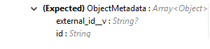

= VeevaVault Connector Reference - Mule 4
ifndef::env-site,env-github[]
include::_attributes.adoc[]
endif::[]
:imagesdir: ../../assets/images/

Support Category: https://www.mulesoft.com/legal/versioning-back-support-policy#anypoint-connectors[Select]

VeevaVault Connector v1.2.0

Guide: xref:./veevavault-connector-get-started.adoc[VeevaVault Connector]

Release Notes: xref:./veevavault-connector-release-notes.adoc[VeevaVault Connector Release Notes]

=== Configuration

==== VeevaVault Connector Connection Config

===== 1 - Basic Connection

[cols=",,,,",options="header",]
|===
|*Name* |*Type* |*Description* |*Default Value* |*Required*
|Name |String |The name for this configuration. Connectors reference the configuration with this name. | |X
|Vault URL |String |The URL of the Veeva Vault instance required for connection | |X
|Username |String |Username used to initialize the session | |X
|Password |String |Password used to authenticate the user | |X
|Version |String |Veeva Vault API version |v19.1 |
|Client Id |String |The Client Id that need to send with each request header to Vault instance in format - \{company}-\{organization}-\{server}-\{component}. E.g veeva-clinical-mulesoft-connector | |X
|===

===== 2 - OAuth2 Connection

[cols=",,,,",options="header",]
|===
|*Name* |*Type* |*Description* |*Default Value* |*Required*
|Vault OAuth Login URL |String |Vault OAuth URL require to trigger to retrieve session Id from vault. |https://login.veevavault.com |
|Vault URL |String |The URL of the Veeva Vault instance required for connection | |X
|Version |String |Veeva Vault API version |v19.1 |
|Client Id |String |The Client Id that need to send with each request header to Vault instance in format - \{company}-\{organization}-\{server}-\{component}. E.g veeva-clinical-mulesoft-connector | |X
|OIDC Profile Id |String |The OIDC Profile Id created on vault while configuring OAuth2.0/OIDC profile. See http://vaulthelp2.vod309.com/wordpress/admin-user-help/authentication-vault-security/configuring-oauth-2-oidc-profiles/[Configuring OAuth 2.0 / OpenID Connect Profiles] | |X
|Consumer Key |String |The consumer key for the Veeva Vault connected application registered on OAuth Service Provider. | |X
|Consumer Secret |String |The consumer secret for the Veeva Vault connected application registered on OAuth Service Provider. | |X
|Authorization URL |String |Authorization URL Authorize to authorize the app for a user. | |X
|Access Token URL |String |An access token url to retrieve access token for authentication. | |X
|Listener Config |String |Configuration for the listener, for example, HTTP_Listener_config. | |X
|Callback Path |String |Path for the callback, for example, /callback. | |X
|Authorize Path |String |Path for authorization, for example, /authorize. | |X
|External Callback URL |String |Callback URL, for example, http://localhost:8085/callback. | |
|===

===== OAuth2 - Authorization Code Configuration
The OAuth2 - Authorization Code configures the OAuth 2.0 authorization code grant type. The OAuth authentication server holds the resources that are protected by OAuth. For example, calls to the VeevaVault Connection operation can be authenticated through OKTA server using OAuth. The example in this section shows you how to create Mule client application to access a protected resource, Retrieve docuemnts data on the VeevaVault configured with OAuth authentication server. The example covers the following things:

* Set up authorization
* Create a Mule client app
* Run the Mule client app

====== Set up authorization
. The app uses these credentials later to identify itself to the authentication server. During the registration, you also provide the URL to the Mule app home page and the application callback URL.
+
. https://developer.okta.com/docs/guides/implement-oauth-for-okta/create-oauth-app/[Register the application]. Provide required details while creating application.
+
. Make sure you store Client Id and Client Secret for future use.

====== Create the Mule Client App
You can create a Mule client app that uses the OKTA assigned client ID and client secret to access vault data on the Veeva Vault instance using OAuth Authentication. The sample consists of an HTTP Listener connector, Get Picklists operation, and a DataWeave (Transform) component for transforming plain text to JSON. In the VeevaVault Connector configuration, you configure access to the authentication server.

The following sections help you configure the Mule client app for accessing the OKTA authentication server.

. Drag HTTP Listener operation from Mule Palette to the Process area of the Studio flow. 
+
. In the properties editor for Connector Configuration, click the green plus icon (or click the Edit icon if you have already created a configuration). Configure HTTP Listener configuration with host (localhost) and port (8081) and provide base path listener as /oauth
+
. Drag Get Picklists from the VeevaVault connector Palette. 
+
. In the properties editor for Connector Configuration, click the green plus icon. In Connection drop down list select "2 - OAuth2 Connection"
+
. In Genral tab, configure the following.
======= Vault Configuration
** Vault OAuth Login URL: Configure with Vault OAuth Login URL to retrieve the session Id, As per Veeva documentation https://developer.veevavault.com/api/19.1/#oauth-2-0-openid-connect[OAuth 2.0/OpenId Connect API]. Default is *https://login.veevavault.com*
** OIDC Profile Id: Vault OIDC Profile Id created after configuring http://vaulthelp2.vod309.com/wordpress/admin-user-help/authentication-vault-security/configuring-oauth-2-oidc-profiles/[OAuth2 OIDC Profile]
** Vault URL: Veeva Vault instance URL to invoke Veeva APIs
** Version: Vault API version to use to invoke Veeva APIs. Default is *v19.1*
** Client Id: Client Id required to send with each request in header. 
+
======= OAuth Authorization Configuration
** Consumer Key: The Client Id that is created on OKTA when you registered the application.
** Consumer Secret: The Client Secret that is created on OKTA when you registered the application.
** Authorization URL: The endpoint to authorize an user to grant access to vault instance. You get this URL when you registered the app on OKTA.
** Access Token URL: The endpoint to retrieve access token for an user to grant access the vault instance. You get this URL when you registered the app on OKTA.
** Scopes: Optional, provide the Scopes if define on OKTA.
** Resource Owner Id: The user that owns the resource (Vault instance) needs to specify the resourceOwnerId to assign to the token when the dance is initiated.
======== OAuth Callback Configuration
** Listener Config: The Listener that will catch access token callback endpoint. Default will pick HTTP Listener configured.
** Callback Path: The path of access token endpoint. Define as */callback*
** Authorize Path: The path of local endpoint which trigger the OAuth dance. Define as */authorize*
** External Callback URL: The OAuth authentication server uses this URL to provide the authentication code to the Mule server so that the Mule server can retrieve the access token. This must be the externally visible address of the callback, not the local one. Define as *http://localhost:8081/callback*
+

+
. Click OK.

*Response Timeout (Advanced Tab)*

[cols=",,,,",options="header",]
|===
|*Name* |*Type* |*Description* |*Default Value* |*Required*
|Response Timeout |Integer |Maximum time in milliseconds that the connector will wait for the [.underline]#Veeva# Vault response. If time elapse will throw Response Timeout Exception. |30000 ms |X
|===

*Burst API Limit Profile (Advanced Tab)*

*<veevavault:burst-api-limit-profile/>*

The Burst API Limit Profile to configure API limit threshold for evaluation with remaining burst API limit calls. Once burst API limit calls reach or exceed the specified threshold limit, connector would wait for specified time period. By default, its disable. For more information refer *https://developer.veevavault.com/docs/#api-rate-limits[API Rate Limit Headers].*

[cols=",,,,",options="header",]
|===
|*Name* |*Type* |*Description* |*Default Value* |*Required*
|API Limit Threshold |Integer |The API Limit Threshold value to set number of API Limit Calls mark as threshold. Once threshold reached, connector warns burst API limit exceed and will wait for specified time period. |200 |X
|Wait Time |Integer |Time the connector will wait once threshold value is reached or exceeds the remaining API calls. |5 |X
|Time Unit a|
DAYS

HOURS

MINUTES

SECONDS

MILISECONDS

NANOSECONDS

| |MINUTES |X
|===

*Daily API Limit Profile (Advanced Tab)*

*<veevavault:daily-api-limit-profile/>*

The Daily API Limit Profile to configure API limit threshold for evaluation with remaining daily API limit calls. Once daily API limit calls reach or exceed the specified threshold limit an exception is thrown. By default, its disable. For more information refer *https://developer.veevavault.com/docs/#api-rate-limits[API Rate Limit Headers].*

[cols=",,,,",options="header",]
|===
|*Name* |*Type* |*Description* |*Default Value* |*Required*
|API Limit Threshold |Integer |The API Limit Threshold value to set number of API Limit Calls mark as threshold. Once threshold reached, connector will throw an API_LIMIT_EXCEED exception for each request invoking an API calls. |10000 |X
|===

=== Associated Operations

* link:#create-documents[*Create Documents*]
* link:#create-document-renditions[*Create Document Renditions*]
* link:#create-object-records[*Create Object Records*]
* link:#delete-document-renditions[*Delete Document Renditions*]
* link:#delete-documents[*Delete Documents*]
* link:#delete-object-records[*Delete Object Records*]
* link:#export-documents[*Export Documents*]
* link:#get-audit-details[*Get Audit Details*]
* link:#get-document-renditions-types[*Get Document Renditions*]
* link:#get-documents[*Get Documents*]
* link:#get-object-records[*Get Object Records*]
* link:#get-picklists[*Get Picklists*]
* link:#query[*Query*]
* link:#spark-validator[*Spark Validator*]
* link:#update-documents[*Update Documents*]
* link:#update-object-records[*Update Object Records*]

=== Operations

==== Create Documents

Create documents creates documents on vault using document metadata provided in CSV or JSON format.

*<veevavault:create-documents>*

*Parameters:*

[cols=",,,,",options="header",]
|===
|*Name* |*Type* |*Description* |*Default Value* |*Required*
|Metadata Format a|
Enum (String)

* CSV
* JSON

|Metadata format either CSV or JSON. | |X
|Document Metadata |Input Stream a|
The document metadata either in CSV OR JSON format as Input Stream respective to Metadata format option selected. Metadata as below:

image:../../assets/images/veevavault/veevavault-connector-create-documents-input.png[image,width=283,height=326]

| |X
|===

*For Configurations:*

link:#veevavault-connector-connection-config[Connection Configuration]

*Throws:*

* VEEVAVAULT:API_LIMIT_EXCEEDED
* VEEVAVAULT:ATTRIBUTE_NOT_SUPPORTED
* VEEVAVAULT:INACTIVE_USER
* VEEVAVAULT:INVALID_DATA
* VEEVAVAULT:INVALID_DOCUMENT
* VEEVAVAULT:INSUFFICIENT_ACCESS
* VEEVAVAULT:MALFORMED_URL
* VEEVAVAULT:METHOD_NOT_SUPPORTED
* VEEVAVAULT:NO_PERMISSION
* VEEVAVAULT:OPERATION_NOT_ALLOWED
* VEEVAVAULT:PARAMETER_REQUIRED

==== Create Document Renditions

Create Document Renditions on vault with provided metadata in CSV/JSON format.

*<veevavault:create-document-renditions>*

*Parameters:*

[cols=",,,,",options="header",]
|===
|*Name* |*Type* |*Description* |*Default Value* |*Required*
|Metadata Format a|
Enum (String)

* CSV
* JSON

|Metadata format either CSV or JSON. | |X
|Document Metadata |Input Stream a|
The document metadata either in CSV OR JSON format as Input Stream respective to Metadata format option selected. Metadata as below:

image:../../assets/images/veevavault/veevavault-connector-create-document-renditions-input.png[image,width=280,height=188]

| |X
|===

*For Configurations:*

link:#veevavault-connector-connection-config[Connection Configuration]

*Throws:*

* VEEVAVAULT:API_LIMIT_EXCEEDED
* VEEVAVAULT:ATTRIBUTE_NOT_SUPPORTED
* VEEVAVAULT:INACTIVE_USER
* VEEVAVAULT:INVALID_DATA
* VEEVAVAULT:INVALID_DOCUMENT
* VEEVAVAULT:INSUFFICIENT_ACCESS
* VEEVAVAULT:MALFORMED_URL
* VEEVAVAULT:METHOD_NOT_SUPPORTED
* VEEVAVAULT:NO_PERMISSION
* VEEVAVAULT:OPERATION_NOT_ALLOWED
* VEEVAVAULT:PARAMETER_REQUIRED

==== Create Object Records

Create Object Records creates an object records in bulk on vault using object metadata either in CSV or JSON format.

*<veevavault:create-object-records>*

*Parameters:*

[cols=",,,,",options="header",]
|===
|*Name* |*Type* |*Description* |*Default Value* |*Required*
|Object Name |String a|
The list of all vault objects available to select anyone from the list. For e.g

image:../../assets/images/veevavault/veevavault-connector-create-object-records-object-name.png[image,width=323,height=246]

| |X
|Metadata Format a|
Enum (String)

CSV

JSON

|Metadata format either CSV or JSON. | |X
|Object Metadata |Input Stream a|
The object metadata either in CSV OR JSON format as Input Stream respective to Metadata format option selected. Metadata as below:

image:../../assets/images/veevavault/veevavault-connector-create-object-records-input.png[image,width=273,height=216]

| |X
|===

*For Configurations:*

link:#veevavault-connector-connection-config[Connection Configuration]

*Throws:*

* VEEVAVAULT:API_LIMIT_EXCEEDED
* VEEVAVAULT:ATTRIBUTE_NOT_SUPPORTED
* VEEVAVAULT:INACTIVE_USER
* VEEVAVAULT:INVALID_DATA
* VEEVAVAULT:INVALID_DOCUMENT
* VEEVAVAULT:INSUFFICIENT_ACCESS
* VEEVAVAULT:MALFORMED_URL
* VEEVAVAULT:METHOD_NOT_SUPPORTED
* VEEVAVAULT:NO_PERMISSION
* VEEVAVAULT:OPERATION_NOT_ALLOWED
* VEEVAVAULT:PARAMETER_REQUIRED

==== Delete Document Renditions

Delete document renditions from vault based on document renditions metadata provided in CSV or JSON format.

*<veevavault:delete-document-renditions>*

*Parameters:*

[cols=",,,,",options="header",]
|===
|*Name* |*Type* |*Description* |*Default Value* |*Required*
|Metadata Format a|
Enum (String)

* CSV
* JSON

|Metadata format either CSV or JSON. | |X
|Document Metadata |Input Stream a|
The document metadata either in CSV OR JSON format as Input Stream respective to Metadata format option selected. Metadata as below:

image:../../assets/images/veevavault/veevavault-connector-delete-document-renditions-input.png[image,width=283,height=122]

| |X
|===

*For Configurations:*

link:#veevavault-connector-connection-config[Connection Configuration]

*Throws:*

* VEEVAVAULT:API_LIMIT_EXCEEDED
* VEEVAVAULT:ATTRIBUTE_NOT_SUPPORTED
* VEEVAVAULT:INACTIVE_USER
* VEEVAVAULT:INVALID_DATA
* VEEVAVAULT:INVALID_DOCUMENT
* VEEVAVAULT:INSUFFICIENT_ACCESS
* VEEVAVAULT:MALFORMED_URL
* VEEVAVAULT:METHOD_NOT_SUPPORTED
* VEEVAVAULT:NO_PERMISSION
* VEEVAVAULT:OPERATION_NOT_ALLOWED
* VEEVAVAULT:PARAMETER_REQUIRED

==== Delete Documents

Delete documents delete documents from vault based on metadata document *Ids* provided in CSV or JSON format.

*<veevavault:delete-documents>*

*Parameters:*

[cols=",,,,",options="header",]
|===
|*Name* |*Type* |*Description* |*Default Value* |*Required*
|Metadata Format a|
Enum (String)

* CSV
* JSON

|Metadata format either CSV or JSON. | |X
|Document Metadata |Input Stream a|
The document metadata either in CSV OR JSON format as Input Stream respective to Metadata format option selected. Metadata as below:

image:../../assets/images/veevavault/veevavault-connector-delete-documents-input.png[image,width=301,height=55]

| |X
|===

*For Configurations:*

link:#veevavault-connector-connection-config[Connection Configuration]

*Throws:*

* VEEVAVAULT:API_LIMIT_EXCEEDED
* VEEVAVAULT:ATTRIBUTE_NOT_SUPPORTED
* VEEVAVAULT:INACTIVE_USER
* VEEVAVAULT:INVALID_DATA
* VEEVAVAULT:INVALID_DOCUMENT
* VEEVAVAULT:INSUFFICIENT_ACCESS
* VEEVAVAULT:MALFORMED_URL
* VEEVAVAULT:METHOD_NOT_SUPPORTED
* VEEVAVAULT:NO_PERMISSION
* VEEVAVAULT:OPERATION_NOT_ALLOWED
* VEEVAVAULT:PARAMETER_REQUIRED

==== Delete Object Records

Delete Object Records delete an object records in bulk on vault using object Id metadata either in CSV or JSON format.

*<veevavault:delete-object-records>*

*Parameters:*

[cols=",,,,",options="header",]
|===
|*Name* |*Type* |*Description* |*Default Value* |*Required*
|Object Name |String a|
The list of all vault objects available to select anyone from the list. For e.g

image:../../assets/images/veevavault/veevavault-connector-create-object-records-object-name.png[image,width=323,height=246]

| |X
|Metadata Format a|
Enum (String)

CSV

JSON

|Metadata format either CSV or JSON. | |X
|Object Metadata |Input Stream a|
The object metadata either in CSV OR JSON format as Input Stream respective to Metadata format option selected. Metadata as below:

| |X
|===

*For Configurations:*

link:#veevavault-connector-connection-config[Connection Configuration]

*Throws:*

* VEEVAVAULT:API_LIMIT_EXCEEDED
* VEEVAVAULT:ATTRIBUTE_NOT_SUPPORTED
* VEEVAVAULT:INACTIVE_USER
* VEEVAVAULT:INVALID_DATA
* VEEVAVAULT:INVALID_DOCUMENT
* VEEVAVAULT:INSUFFICIENT_ACCESS
* VEEVAVAULT:MALFORMED_URL
* VEEVAVAULT:METHOD_NOT_SUPPORTED
* VEEVAVAULT:NO_PERMISSION
* VEEVAVAULT:OPERATION_NOT_ALLOWED
* VEEVAVAULT:PARAMETER_REQUIRED

==== Export Documents

An Export documents allows to query a set of documents for export to your vault’s FTP Staging server.

*<veevavault:export-documents>*

*Parameters:*

[cols=",,,,",options="header",]
|===
|*Name* |*Type* |*Description* |*Default Value* |*Required*
|Metadata Format a|
Enum (String)

* CSV
* JSON

|Metadata format either CSV or JSON. | |X
|Document Metadata |Input Stream a|
The document metadata (document Ids) either in CSV OR JSON format as Input Stream respective to Metadata format option selected. Metadata as below:

image:../../assets/images/veevavault/veevavault-connector-export-documents-input.png[image,width=297,height=90]

|#[payload] |X
|Source |Boolean |To exclude source files. |True |
|Renditions |Boolean |To include renditions. |False |
|All Versions |Boolean |To include all versions or latest version |False |
|Polling Interval |Integer |To poll the vault at specified interval in seconds until job is successful. |30 |
|===

*For Configurations:*

link:#veevavault-connector-connection-config[Connection Configuration]

*Throws:*

* VEEVAVAULT:API_LIMIT_EXCEEDED
* VEEVAVAULT:ATTRIBUTE_NOT_SUPPORTED
* VEEVAVAULT:INACTIVE_USER
* VEEVAVAULT:INVALID_DATA
* VEEVAVAULT:INVALID_DOCUMENT
* VEEVAVAULT:INSUFFICIENT_ACCESS
* VEEVAVAULT:MALFORMED_URL
* VEEVAVAULT:METHOD_NOT_SUPPORTED
* VEEVAVAULT:NO_PERMISSION
* VEEVAVAULT:OPERATION_NOT_ALLOWED
* VEEVAVAULT:PARAMETER_REQUIRED

==== Get Audit Details

Get Audit details retrieves an audit details for a specific audit type.

*<veevavault:get-audit-details>*

*Parameters:*

[cols=",,,,",options="header",]
|===
|*Name* |*Type* |*Description* |*Default Value* |*Required*
|Audit Type |String a|
The list of audit types available on vault to select anyone from the list. For e.g

image:../../assets/images/veevavault/veevavault-connector-get-audit-details-audit-types.png[image,width=299,height=106]

| |X
|Start Date |String |A Start date to retrieve audit information from date specified. Dates must be YYYY-MM-DDTHH:MM:SSZ format | |
|End Date |String |A End date to retrieve audit information till date specified. Dates must be YYYY-MM-DDTHH:MM:SSZ format | |
|Fetch Size |Integer |The fetch size which limit the records per page |100 |
|Batch Size |Integer |The batch size which accommodate number of pages in specified number of batches. |10 |
|===

*For Configurations:*

link:#veevavault-connector-connection-config[Connection Configuration]

*Throws:*

* VEEVAVAULT:API_LIMIT_EXCEEDED
* VEEVAVAULT:ATTRIBUTE_NOT_SUPPORTED
* VEEVAVAULT:INACTIVE_USER
* VEEVAVAULT:INVALID_DATA
* VEEVAVAULT:INVALID_DOCUMENT
* VEEVAVAULT:INSUFFICIENT_ACCESS
* VEEVAVAULT:MALFORMED_URL
* VEEVAVAULT:METHOD_NOT_SUPPORTED
* VEEVAVAULT:NO_PERMISSION
* VEEVAVAULT:OPERATION_NOT_ALLOWED
* VEEVAVAULT:PARAMETER_REQUIRED

==== Get Document Renditions Types

Get Document renditions types to retrieve document renditions details.

*<veevavault:get-document-renditions>*

*Parameters:*

[cols=",,,,",options="header",]
|===
|*Name* |*Type* |*Description* |*Default Value* |*Required*
|Document Metadata |Input Stream a|
The document metadata contains only *documentId* either in CSV OR JSON format as Input Stream. Metadata as below:

image:../../assets/images/veevavault/veevavault-connector-get-document-renditions-types-input.png[image,width=293,height=38]

| |X
|===

*For Configurations:*

link:#veevavault-connector-connection-config[Connection Configuration]

*Throws:*

* VEEVAVAULT:API_LIMIT_EXCEEDED
* VEEVAVAULT:ATTRIBUTE_NOT_SUPPORTED
* VEEVAVAULT:INACTIVE_USER
* VEEVAVAULT:INVALID_DATA
* VEEVAVAULT:INVALID_DOCUMENT
* VEEVAVAULT:INSUFFICIENT_ACCESS
* VEEVAVAULT:MALFORMED_URL
* VEEVAVAULT:METHOD_NOT_SUPPORTED
* VEEVAVAULT:NO_PERMISSION
* VEEVAVAULT:OPERATION_NOT_ALLOWED
* VEEVAVAULT:PARAMETER_REQUIRED

==== Get Documents

Get documents retrieve document details from vault based on document type, subtype, classification options selected. There is an option to provide document properties which incorporate to build VQL query, otherwise document properties are fetch based on type, subtype and classification.

*<veevavault:get-documents>*

*Parameters:*

[cols=",,,,",options="header",]
|===
|*Name* |*Type* |*Description* |*Default Value* |*Required*
|Type |String |The list of all document types available on vault to select anyone from the list. | |
|Subtype |String |The list of all document subtypes available on vault to select anyone from the list. | |
|Classification |String |The list of all document classification available on vault to select anyone from the list. | |
|Document Properties |List<String> |Document properties based on business requirement can be inserted into the list. If not provided it will select all queryable document properties to build VQL query and invoke internally to retrieve document details. | |
|WHERE Clause |String |A where clause which can be appended to VQL query build dynamically. | |
|Fetch Size |Integer |The fetch size which limit the records per page |100 |
|Batch Size |Integer |The batch size which accommodate number of pages in specified number of batches. |10 |
|===

*For Configurations:*

link:#veevavault-connector-connection-config[Connection Configuration]

*Throws:*

* VEEVAVAULT:API_LIMIT_EXCEEDED
* VEEVAVAULT:ATTRIBUTE_NOT_SUPPORTED
* VEEVAVAULT:INACTIVE_USER
* VEEVAVAULT:INVALID_DATA
* VEEVAVAULT:INVALID_DOCUMENT
* VEEVAVAULT:INSUFFICIENT_ACCESS
* VEEVAVAULT:MALFORMED_URL
* VEEVAVAULT:METHOD_NOT_SUPPORTED
* VEEVAVAULT:NO_PERMISSION
* VEEVAVAULT:OPERATION_NOT_ALLOWED
* VEEVAVAULT:PARAMETER_REQUIRED

==== Get Object Records

Get Object Records retrieves an object records in bulk on vault using object Id metadata either in CSV or JSON format.

*<veevavault:get-object-records>*

*Parameters:*

[cols=",,,,",options="header",]
|===
|*Name* |*Type* |*Description* |*Default Value* |*Required*
|Object Name |String a|
The list of all vault objects available to select anyone from the list. For e.g

image:../../assets/images/veevavault/veevavault-connector-create-object-records-object-name.png[image,width=323,height=246]

| |X
|Object Fields |List<String> |Object fields based on business requirement can be inserted into list. If not provided it will select all active object fields available to build VQL query and invoke internally to retrieve object records details. | |
|WHERE Clause |String |A where clause which can be appended to VQL query build dynamically. | |
|Fetch Size |Integer |The fetch size which limit the records per page |100 |
|Batch Size |Integer |The batch size which accommodate number of pages in specified number of batches. |10 |
|===

*For Configurations:*

link:#veevavault-connector-connection-config[Connection Configuration]

*Throws:*

* VEEVAVAULT:API_LIMIT_EXCEEDED
* VEEVAVAULT:ATTRIBUTE_NOT_SUPPORTED
* VEEVAVAULT:INACTIVE_USER
* VEEVAVAULT:INVALID_DATA
* VEEVAVAULT:INVALID_DOCUMENT
* VEEVAVAULT:INSUFFICIENT_ACCESS
* VEEVAVAULT:MALFORMED_URL
* VEEVAVAULT:METHOD_NOT_SUPPORTED
* VEEVAVAULT:NO_PERMISSION
* VEEVAVAULT:OPERATION_NOT_ALLOWED
* VEEVAVAULT:PARAMETER_REQUIRED

==== Get Picklists

The Get Picklists retrieve all available values configured on a picklist.

*<veevavault:get-picklists>*

*Parameters:*

[cols=",,,,",options="header",]
|===
|*Name* |*Type* |*Description* |*Default Value* |*Required*
|Picklist Name |String a|
The list of audit types available on vault to select anyone from the list. For e.g

| |X
|===

*For Configurations:*

link:#veevavault-connector-connection-config[Connection Configuration]

*Throws:*

* VEEVAVAULT:API_LIMIT_EXCEEDED
* VEEVAVAULT:ATTRIBUTE_NOT_SUPPORTED
* VEEVAVAULT:INACTIVE_USER
* VEEVAVAULT:INVALID_DATA
* VEEVAVAULT:INVALID_DOCUMENT
* VEEVAVAULT:INSUFFICIENT_ACCESS
* VEEVAVAULT:MALFORMED_URL
* VEEVAVAULT:METHOD_NOT_SUPPORTED
* VEEVAVAULT:NO_PERMISSION
* VEEVAVAULT:OPERATION_NOT_ALLOWED
* VEEVAVAULT:PARAMETER_REQUIRED

==== Query

A Query to execute specified VQL query on Vault and retrieve result in pagination. A pagination is based on Veeva’s API.

*<veevavault:query>*

*Parameters:*

[cols=",,,,",options="header",]
|===
|*Name* |*Type* |*Description* |*Default Value* |*Required*
|VQL Query |String a|
A VQL Query to be define as per Veeva VQL specification to be executed. Refer https://developer.veevavault.com/api/19.1/#vault-query-language-vql[VQL Query documentation] for more details. E.g:

*SELECT id, name__v, study__v FROM :table*

| |X
|Input Parameters |Map<String, Object> a|
A Maps of String and Object in which every item represents a row to be inserted, and the map contains the parameter names as keys and the value the parameter is bound to. E.g:

{

*'table': 'site__v'*

}

|#[{}] |
|Fetch Size |Integer |The fetch size which limit the records per page |100 |
|Batch Size |Integer |The batch size which accommodate number of pages in specified number of batches. |10 |
|===

*For Configurations:*

link:#veevavault-connector-connection-config[Connection Configuration]

*Throws:*

* VEEVAVAULT:API_LIMIT_EXCEEDED
* VEEVAVAULT:ATTRIBUTE_NOT_SUPPORTED
* VEEVAVAULT:INACTIVE_USER
* VEEVAVAULT:INVALID_DATA
* VEEVAVAULT:INVALID_DOCUMENT
* VEEVAVAULT:INSUFFICIENT_ACCESS
* VEEVAVAULT:MALFORMED_URL
* VEEVAVAULT:METHOD_NOT_SUPPORTED
* VEEVAVAULT:NO_PERMISSION
* VEEVAVAULT:OPERATION_NOT_ALLOWED
* VEEVAVAULT:PARAMETER_REQUIRED

==== Spark Validator

The Spark Validator validates and verify the Spark message with signature and public key retrieved from Vault.

*<veevavault:spark-message-validator>*

*Parameters:*

[cols=",,,,",options="header",]
|===
|*Name* |*Type* |*Description* |*Default Value* |*Required*
|Include Spark Headers|
Boolean
|Flag to include Spark Headers in Spark Message Validator output. 

|FALSE|
|Public Key Path|
String
|The directory path to store public key (00001.pem) file retrieved from Vault, if does not exists.
|${mule.home}/apps/${app.name}/publickeys|

|Spark Headers|
Object
|An attributes header received from Vault embed in Spark message.
|#[attributes.headers]|

|Spark Message|
Input Stream
|A Spark body message received from Vault.
|#[payload]|

|===

*For Configurations:*

link:#veevavault-connector-connection-config[Connection Configuration]

*Throws:*

* VEEVAVAULT:API_LIMIT_EXCEEDED
* VEEVAVAULT:ATTRIBUTE_NOT_SUPPORTED
* VEEVAVAULT:INACTIVE_USER
* VEEVAVAULT:INVALID_DATA
* VEEVAVAULT:INVALID_DOCUMENT
* VEEVAVAULT:INSUFFICIENT_ACCESS
* VEEVAVAULT:MALFORMED_URL
* VEEVAVAULT:METHOD_NOT_SUPPORTED
* VEEVAVAULT:NO_PERMISSION
* VEEVAVAULT:OPERATION_NOT_ALLOWED
* VEEVAVAULT:PARAMETER_REQUIRED
* VEEVAVAULT:INVALID_SPARK_MESSAGE
* VEEVAVAULT:INVALID_KEY_FORMAT

==== Update Documents

Update documents update the documents on vault using editable document metadata provided in CSV or JSON format.

*<veevavault:update-documents>*

*Parameters:*

[cols=",,,,",options="header",]
|===
|*Name* |*Type* |*Description* |*Default Value* |*Required*
|Metadata Format a|
Enum (String)

* CSV
* JSON

|Metadata format either CSV or JSON. | |X
|Document Metadata |Input Stream a|
The editable document metadata either in CSV OR JSON format as Input Stream respective to Metadata format option selected. Metadata as below:

image:../../assets/images/veevavault/veevavault-connector-update-documents-input.png[image,width=286,height=343]

| |X
|===

*For Configurations:*

link:#veevavault-connector-connection-config[Connection Configuration]

*Throws:*

* VEEVAVAULT:API_LIMIT_EXCEEDED
* VEEVAVAULT:ATTRIBUTE_NOT_SUPPORTED
* VEEVAVAULT:INACTIVE_USER
* VEEVAVAULT:INVALID_DATA
* VEEVAVAULT:INVALID_DOCUMENT
* VEEVAVAULT:INSUFFICIENT_ACCESS
* VEEVAVAULT:MALFORMED_URL
* VEEVAVAULT:METHOD_NOT_SUPPORTED
* VEEVAVAULT:NO_PERMISSION
* VEEVAVAULT:OPERATION_NOT_ALLOWED
* VEEVAVAULT:PARAMETER_REQUIRED

==== Update Object Records

Update Object Records updates an object records in bulk on vault using editable object metadata either in CSV or JSON format.

*<veevavault:update-object-records>*

*Parameters:*

[cols=",,,,",options="header",]
|===
|*Name* |*Type* |*Description* |*Default Value* |*Required*
|Object Name |String a|
The list of all vault objects available to select anyone from the list. For e.g

image:../../assets/images/veevavault/veevavault-connector-create-object-records-object-name.png[image,width=323,height=246]

| |X
|Metadata Format a|
Enum (String)

CSV

JSON

|Metadata format either CSV or JSON. | |X
|Object Metadata |Input Stream a|
The object metadata either in CSV OR JSON format as Input Stream respective to Metadata format option selected. Metadata as below:

image:../../assets/images/veevavault/veevavault-connector-update-object-records-input.png[image,width=283,height=346]

| |X
|===

*For Configurations:*

link:#veevavault-connector-connection-config[Connection Configuration]

*Throws:*

* VEEVAVAULT:API_LIMIT_EXCEEDED
* VEEVAVAULT:ATTRIBUTE_NOT_SUPPORTED
* VEEVAVAULT:INACTIVE_USER
* VEEVAVAULT:INVALID_DATA
* VEEVAVAULT:INVALID_DOCUMENT
* VEEVAVAULT:INSUFFICIENT_ACCESS
* VEEVAVAULT:MALFORMED_URL
* VEEVAVAULT:METHOD_NOT_SUPPORTED
* VEEVAVAULT:NO_PERMISSION
* VEEVAVAULT:OPERATION_NOT_ALLOWED
* VEEVAVAULT:PARAMETER_REQUIRED

==== Invoke REST API

Invoke REST API operation invokes Veeva Vault REST API and returns response in JSON or XML format depending on header *Accept* value provided. Default response is in JSON.

*<veevavault:invoke-rest-api>*

*Parameters:*

[cols=",,,,",options="header",]
|===
|*Name* |*Type* |*Description* |*Default Value* |*Required*
|Method |String a|
The list of methods to invoke REST API. Default is *GET*.

|GET|X
|Path |String | 
The URI Path where request will be sent.

| |X
|Body |Input Stream |
The body of the request message send along with request except GET method request. Default is payload.

|#[payload]  |
|Headers |Map |
Headers in key-value format to send along with request, if there are no headers required in a request keep empty. Default is an *Empty list*.

| |
|URI Parameters |Map |
URI Parameters in key-value format to resolve value in a path, if there are no URI parameters in a path keep empty. Default is an *Empty List*.

| |
|Query Parameters |Map |
Query Parameters in key-value format to send along with request, if there are no query parameters required in a request keep empty. Default is an *Empty list*.

| |
|Request Streaming Mode |Stream |
Request to send in streaming mode, select option from drop down list. By default, if the type of the payload is a stream, streaming is used to send the request.

	ALWAYS
	
	AUTO
	
	NEVER

| |
|===

*For Configurations:*

link:#veevavault-connector-connection-config[Connection Configuration]

*Throws:*

* VEEVAVAULT:API_LIMIT_EXCEEDED
* VEEVAVAULT:ATTRIBUTE_NOT_SUPPORTED
* VEEVAVAULT:INACTIVE_USER
* VEEVAVAULT:INVALID_DATA
* VEEVAVAULT:INVALID_DOCUMENT
* VEEVAVAULT:INSUFFICIENT_ACCESS
* VEEVAVAULT:MALFORMED_URL
* VEEVAVAULT:METHOD_NOT_SUPPORTED
* VEEVAVAULT:NO_PERMISSION
* VEEVAVAULT:OPERATION_NOT_ALLOWED
* VEEVAVAULT:PARAMETER_REQUIRED

